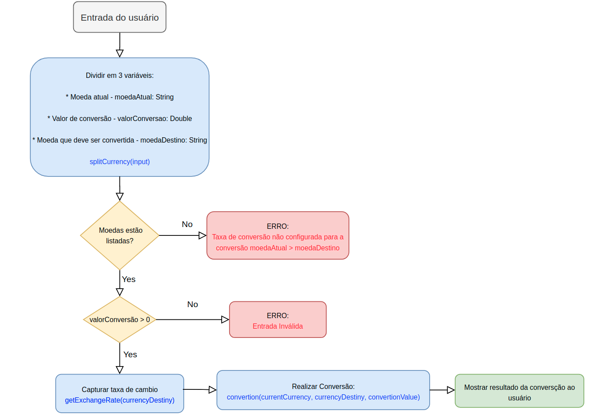

# Conversor de Moedas de Trust

Aplicação para converter a moeda de valores monetários.

##Sumário

* <a href="#Projeto a ser desnvolvido"> Projeto a ser desenvolvido</a>
* <a href="#PlanoDeEstudo"> Plano de estudos</a>
*  <a href="#PlanoDeEstudo_EtapasDoProjeto"> Etapas do projeto de conversão de moedas </a>
      *  <a href="#PlanoDeEstudo_EtapasDoProjeto_Semana1"> Semana 1: Resolver o problema utilizando conhecimento Kotlin</a>
	  *  <a href="#PlanoDeEstudo_EtapasDoProjeto_Semana2"> Semana 2: Utilizar Spring Boot para desenvolver um endpoint</a>
	  *  <a href="#PlanoDeEstudo_EtapasDoProjeto_Semana3"> Semana 3: Utilizar MongoDB para desenvolver uma persistência de dados</a>
	  *  <a href="#PlanoDeEstudo_EtapasDoProjeto_Semana4"> Semana 4: Resolver o problema utilizando uma API externa</a>
	  *  <a href="#PlanoDeEstudo_EtapasDoProjeto_Semana5"> Semana 5: Dockerizar a aplicação</a>
* <a href="#EstruturaDoProjeto"> Estrutura do Projeto </a>
* <a href="#MaterialDeApoio"> Material de Aporio</a>

---

<h2 id="#ProjetoASerDesnvolvido"> Projeto a ser desenvolvido</h2>
O projeto a ser desenvolvido é uma aplicação para converter a moeda de valores monetários.
No projeto do repositorio existe uma issue que detalha as taxas de conversão, formatos de entrada e saída, form de utilização da aplicação e critérios de aceitação.
Link para a issue: https://github.com/yrachid/currency-conversion/issues/1

<h2 id="PlanoDeEstudo">  Plano de estudos</h2>

<h3  id="PlanoDeEstudo_EtapasDoProjeto"> Etapas do projeto de conversão de moedas </h3>

O objetivo do conversor de moedas é ser um projeto que permita adquirir e aplicar novos conhecimentos gradualmente. Ao longo de cinco semanas, o projeto evoluirá a fim de propor um novo desafio a cada semana.

> Se possível, recomendamos investir um tempo para tentar aprender testes automatizados. Eles ajudarão ao longo de todas as etapas, validando cada incremento da solução e evitando alteração de comportamento sem previsibilidade.

> _"Acceptance tests are critical in an agile environment because they answer the questions, “How do I know when I am done?” for developers and “Did I get what I wanted?” for users."_
>
> Humble, Jez; Farley, David. Continuous Delivery (Addison-Wesley Signature Series (Fowler)) (p. 85). Kindle Edition.

<h3  id="PlanoDeEstudo_EtapasDoProjeto_Semana1"> Semana 1: Resolver o problema utilizando conhecimento Kotlin </h3>
Pensando em resolução em um formato mais simples mesmo, utilizando um terminal e aplicando conhecimento de Kotlin.

<h3  id="PlanoDeEstudo_EtapasDoProjeto_Semana2"> Semana 2: Utilizar Spring Boot para desenvolver um endpoint </h3>Transformar o conversor desenvolvido na semana 1 em uma api web, expondo um endpoint que realize a mesma operação proposta na etapa anterior. 

<h3  id="PlanoDeEstudo_EtapasDoProjeto_Semana3"> Semana 3: Utilizar MongoDB para desenvolver uma persistência de dados</h3>
Persistir as taxas de câmbio em uma coleção MongoDB. Talvez versionar as taxas de câmbio por data, permitindo conversões retroativas.

<h3  id="PlanoDeEstudo_EtapasDoProjeto_Semana4">Semana 4: Resolver o problema utilizando uma API externa</h3>
Consumir uma API real que forneça taxas de câmbio atualizadas e utilizar isso na resolução do problema. Sugestões:
- [Frankfurter](https://www.frankfurter.app/docs/)
- [Lista de outras APIs públicas de taxa de câmbio](https://github.com/public-apis/public-apis#currency-exchange)

<h3  id="PlanoDeEstudo_EtapasDoProjeto_Semana5"> Semana 5: Dockerizar a aplicação</h3>
Dockerizar a aplicação permitirá entender as vantagens trazidas pelos containers para os projetos de software modernos. Também facilitará o entendimento do papel dos containers na infraestrutura da Creditas.

<h2 id="EstruturaDoProjeto"> Estrutura do Projeto </h2>
Pensando em como deveria ser estruturado o sistema do de ***Currency Conversion* **, foi desenvolvido o esquema abaixo o qual temos representado a estrutura da classe que irá ser desenvolvida.
 
A classe **CurrencyConversion**, seria responsável por ter os atributos:

  

| Atributos  | Type  | Descrição|
| ------------ | ------------------------- |------------ |
| currencyCode  | Enum < String > | Responsável por armazenar todos as possíveis moedas que o sistema é capaz de converter |
|  currencyExchangeRate |  Array < Double >  |  Matriz responsável por conter as taxas de  câmbio, usadas para conversão |
|  conversionValue |  Int |  Valor capturado do usuário para ser convertido|
|  currencyDestiny |  String | Codigo da moeda, capturado pelo usuário, para qual deve ser feita a conversão |
|  conversionValue | String  | Codigo da moeda atual, capturado pelo usuário  |

O atributo ***currencyExchangeRate*** seguiria a estrutura da tabela de taxas de cambio abaixo:

	 

  
Além deste atributos a classe também apresentaria os principais métodos:

| Métodos  | Parâmetros| Retorno  |
| ------------ | ------------------------- |------------ |
| splitCurrency(input)  | Recebe como entrada o valor digitado pelo usuário com os codigos das moedas e o valor para conversão | Retorna 3 valores separados, o  conversionValue, currencyDestiny e conversionValue|  
|  conversion(currentCurrency, currentDestiny, conversionValue) |  Recebe como entrada os valores necessários para realizar o calculos e os Codes das moedas que serão usadas para conversão | Retorna o valor esperado da conversão da moeda |

 
Pensado no ***fluxo que o sistema deve seguir*** foi feito o fluxograma abaixo:

	 

 

---
<h2 id="MaterialDeApoio">Material de Apoio</h2>

Separamos alguns conteúdos que podem ser utilizados para auxiliar na resolução do problema ou para praticar conceitos:

### Kotlin
- https://youtube.com/playlist?list=PLM8_o_MDe-LElQqV-SZtlyGt8l7iz770r
- https://play.kotlinlang.org/koans/overview
- https://exercism.io/tracks/kotlin
- https://github.com/aceleradora-TW/trilha-de-exercicios/tree/master/src/java/specs

### Testes unitários
- https://spin.atomicobject.com/2018/10/07/kotlin-unit-testing/
- https://bugfender.com/blog/how-to-write-unit-tests-for-kotlin/ 

### Spring Boot
- https://www.baeldung.com/spring-boot
- https://www.youtube.com/watch?v=iNeYefuqj-E&t=102s
- https://youtube.com/playlist?list=PLM8_o_MDe-LEas_XSKIyaFAp_MS__5j4p

### MongoDB
- https://university.mongodb.com/courses/M001/about
- https://fabiano-goes.medium.com/crud-api-rest-com-kotlin-spring-e-mongodb-521a8676f43a
- https://medium.com/techwasti/spring-boot-mongodb-rest-api-using-kotlin-47e49729bb21

### Docker
- https://github.com/gomex/docker-para-desenvolvedores
- https://github.com/guirisnik/docker-training
- https://www.kodekloud.com/p/docker-labs
